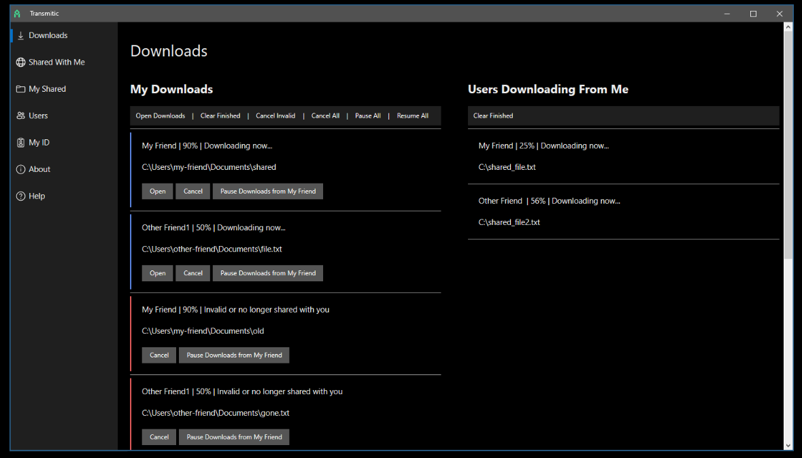

# Transmitic: In Development Alpha

Transmitic is an encrypted, peer to peer, file transfer program with download pause and resume.  
Transmitic is in early development.

Discord: [https://discord.gg/tRT3J6T](https://discord.gg/tRT3J6T)  
Reddit: [https://www.reddit.com/r/transmitic/](https://www.reddit.com/r/transmitic/)  
Twitter: [https://twitter.com/transmitic](https://twitter.com/transmitic)  
Website: [https://transmitic.io/](https://transmitic.io/)  

## Support Transmitic

[Patreon](https://www.patreon.com/andrewshay)

## Setup & Usage

See wiki [https://github.com/transmitic/transmitic/wiki](https://github.com/transmitic/transmitic/wiki)

## Comparison To Other Tools

**Bittorrent**  
Transmitic does not support bittorrent, or bittorent like functionality. Transmitic cannot download the same file from multiple peers to download it faster.  
Users connect to one another directly via IP.  

**File Syncing**  
Transmitic does _not_ have any file syncing capability and should never be used for this purpose.

## Development Status

Transmitic is an alpha that is in early development.  
At this time, expect:  

- Incomplete error handling on edge cases
- Config file usage for advanced configuration
- No attention to performance
- No code quality
- No code reviews
- No tests

This project is slowly being hacked on during nights and weekends.  
It will eventually reach a stable and tested point.

## Contributing

The only area of contribution that is needed at this time is a review of the cryptography usage.  
If you are interested, please visit the [Discord](https://discord.gg/tRT3J6T).

## Dependencies

- [Rust (backend)](https://www.rust-lang.org/)
- [Sciter (GUI)](http://sciter.com/)
- [ring](https://briansmith.org/rustdoc/ring/)
- [aes-gcm](https://docs.rs/aes-gcm/0.8.0/aes_gcm/)
- [x25519_dalek](https://docs.rs/x25519-dalek/1.1.0/x25519_dalek/)
- [serde](https://serde.rs/)

## Goals (Short Term and Long Term)

- Fix sending large number of files to user
- GUI redesign
- GUI for advanced settings
- Additional error handling around edge cases
- Major code refactor
- Tests
- Transmitic Discovery
  - Server to discover users without requiring IPs to be known by users (optional to users)
- UPnP
- Add Users with a "friend request"
- Auto updates
- Transmitic Mini
  - CLI only version with minimal dependencies
- Rewrite for performance?
  - tokio?
- Verify file downloads with hashes?

## Cryptography Usage

- Public, Private signing keys generated with `ring`
- Signing `ring` keys are exchanged out of band
- Diffie-Hellman key generation with `x25519_dalek`
  - Diffie-Hellman keys are regenerated for every new TCP stream. Never reused.
- Diffie-Hellman `x25519_dalek` keys are signed with the `ring` keys
- Remote user verifies `x25519_dalek` key with that user's `ring` public key
- AES key generated
- All further communication encrypted with `AES-GCM` with `ring`

## Protocol Overview

- TODO

## Screenshots

### Current

### Mockups

[https://github.com/transmitic/transmitic/wiki/UI-Mockup](https://github.com/transmitic/transmitic/wiki/UI-Mockup)

## License

This project is provided "AS IS" and makes no warranties, express or implied.  

To be determined.